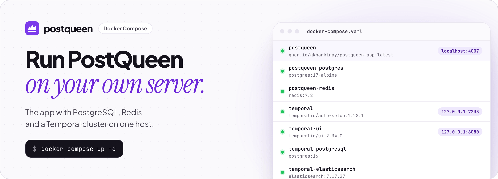
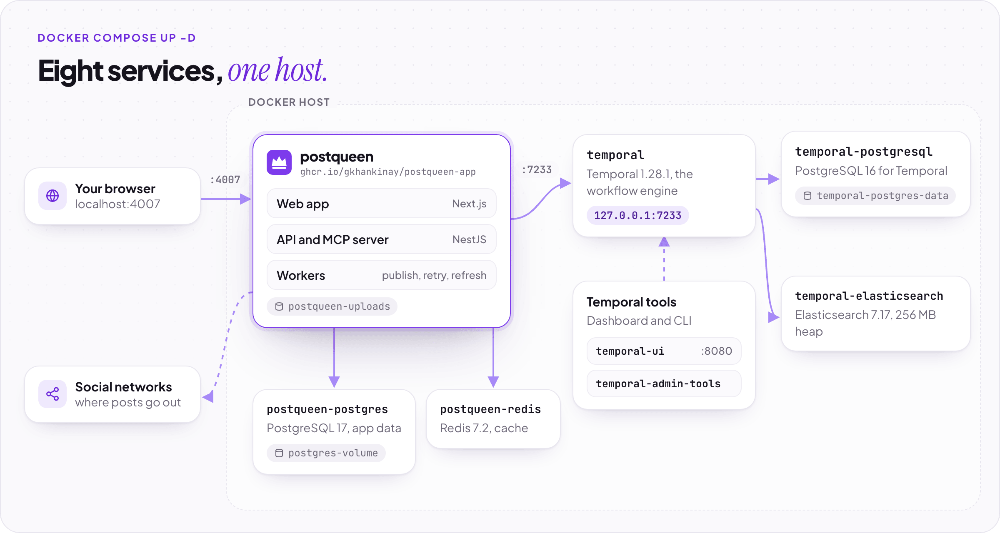

<p align="center">
  <picture>
    <source media="(prefers-color-scheme: dark)" srcset=".github/assets/banner-dark.png">
    
  </picture>
</p>

<p align="center">
  Self-host PostQueen with Docker Compose: the app with PostgreSQL, Redis and a Temporal cluster on one host.
</p>

<p align="center">
  <a href="https://postqueen.ai"><b>Website</b></a> ·
  <a href="https://docs.postqueen.ai/installation/docker-compose"><b>Docs</b></a> ·
  <a href="https://postqueen.ai/pricing"><b>Pricing</b></a> ·
  <a href="https://github.com/GkhanKINAY/postqueen-app/pkgs/container/postqueen-app"><b>Image</b></a>
</p>

<p align="center">
  <a href="LICENSE"></a>
  <a href="https://github.com/GkhanKINAY/postqueen-app/pkgs/container/postqueen-app"></a>
</p>

<p align="center">
  <a href="https://docs.postqueen.ai/agents/grok-bot"><picture><source media="(prefers-color-scheme: dark)" srcset="https://raw.githubusercontent.com/GkhanKINAY/postqueen-app/main/.github/assets/showcase/announce-dark.png"></picture></a>
</p>

<p align="center">
  <a href="https://app.postqueen.ai/auth?utm_source=github&utm_medium=readme&utm_campaign=postqueen-docker-compose&utm_content=hero-button"><picture><source media="(prefers-color-scheme: dark)" srcset="https://raw.githubusercontent.com/GkhanKINAY/postqueen-app/main/.github/assets/showcase/btn-trial-dark.png"></picture></a><a href="https://docs.postqueen.ai/agents/overview"><picture><source media="(prefers-color-scheme: dark)" srcset="https://raw.githubusercontent.com/GkhanKINAY/postqueen-app/main/.github/assets/showcase/btn-agent-dark.png"></picture></a>
</p>

<p align="center">
  <sub><b>$0 due today.</b> A card is required, and you pay nothing if you cancel within 7 days.</sub>
</p>

<p align="center">
  <a href="https://docs.postqueen.ai/agents/overview"><picture><source media="(prefers-color-scheme: dark)" srcset="https://raw.githubusercontent.com/GkhanKINAY/postqueen-app/main/.github/assets/showcase/works-dark.png"></picture></a>
</p>


## What it does

- Runs the prebuilt image `ghcr.io/gkhankinay/postqueen-app:latest`, with no build step.
- Starts PostgreSQL for the app, Redis as its cache, and a Temporal cluster for scheduling and publishing.
- Serves the app on `http://localhost:4007`.
- Keeps your data in named Docker volumes.

<picture>
  <source media="(prefers-color-scheme: dark)" srcset=".github/assets/architecture-dark.png">
  
</picture>

[PostQueen](https://github.com/GkhanKINAY/postqueen-app) is a social media scheduler with an AI copilot that posts to 30+ networks. It is open source under AGPL-3.0, and this repository is the quickest way to run it on your own server.

## Quick start

You need Docker Engine 24 or newer, Docker Compose v2.24 or newer (`docker compose`) and about 4 GB of RAM, because the Temporal cluster includes Elasticsearch.

```bash
git clone https://github.com/GkhanKINAY/postqueen-docker-compose
cd postqueen-docker-compose
printf 'JWT_SECRET=%s\nENCRYPTION_KEY=%s\nNOT_SECURED=true\n' "$(openssl rand -hex 32)" "$(openssl rand -hex 32)" > .env
docker compose up -d
```

The first start takes a couple of minutes while Temporal sets itself up. Then open `http://localhost:4007`.

The `.env` file holds your own secrets. `NOT_SECURED=true` lets the login cookie work over plain HTTP on your machine. Remove it before the app is reachable by anyone else, and follow [Going to production](#going-to-production).

## Running it

### Configuration

Every setting is an environment variable on the `postqueen` service. Put your values in the `.env` file next to `docker-compose.yaml`; Compose reads it for the listed keys, and `env_file` passes extra keys through. After a change, recreate the app container:

```bash
docker compose up -d --no-deps --force-recreate postqueen
```

| Variable | Default | What it does |
| --- | --- | --- |
| `MAIN_URL` | `http://localhost:4007` | Public address of the app |
| `FRONTEND_URL` | `http://localhost:4007` | Address the browser loads |
| `NEXT_PUBLIC_BACKEND_URL` | `http://localhost:4007/api` | Public API address, the same host plus `/api` |
| `JWT_SECRET` | a placeholder | Signs login sessions. Set a long random value that is unique to your install. |
| `ENCRYPTION_KEY` | empty, falls back to `JWT_SECRET` | Encrypts stored secrets, such as the app passwords and keys typed in when a channel is connected. Set it before you have real data. |
| `NOT_SECURED` | not set | `true` only for local HTTP login. Never on a public server. |
| `DISABLE_REGISTRATION` | `false` | `true` closes sign-up once the first account exists. |
| `DATABASE_URL` | the bundled `postqueen-postgres` | PostgreSQL connection string |
| `REDIS_URL` | the bundled `postqueen-redis` | Redis connection string |
| `STORAGE_PROVIDER` | `local` | Where uploaded media is kept: `local` or `cloudflare` |

The three URL variables must point at the same public address, or you get a blank screen or a login loop. The bundled database password is `postqueen-password`; change it in both the `postqueen-postgres` service and `DATABASE_URL`. Every other setting, including email, storage and each network's keys, is in the [configuration reference](https://docs.postqueen.ai/configuration/reference).

### Services

| Service | Image | Host port | Purpose |
| --- | --- | --- | --- |
| `postqueen` | `ghcr.io/gkhankinay/postqueen-app:latest` | `4007` | Web app, API and Temporal workers |
| `postqueen-postgres` | `postgres:17-alpine` | none | App database |
| `postqueen-redis` | `redis:7.2` | none | Cache |
| `temporal` | `temporalio/auto-setup:1.28.1` | `127.0.0.1:7233` | Workflow engine for scheduling and publishing |
| `temporal-ui` | `temporalio/ui:2.34.0` | `127.0.0.1:8080` | Temporal dashboard |
| `temporal-postgresql` | `postgres:16` | none | Temporal's database |
| `temporal-elasticsearch` | `elasticsearch:7.17.27` | none | Temporal's search index, with a 256 MB heap |
| `temporal-admin-tools` | `temporalio/admin-tools:1.28.1-tctl-1.18.4-cli-1.4.1` | none | Temporal command-line tools |

An optional `spotlight` service for debugging runs only with the `debug` profile.

### Going to production

Social networks send their sign-in callbacks to a public HTTPS address, so connecting real accounts needs a domain.

1. Put a reverse proxy with TLS in front of port `4007`: [Caddy](https://docs.postqueen.ai/installation/domain-and-https), [nginx](https://docs.postqueen.ai/reverse-proxies/nginx) or [Traefik](https://docs.postqueen.ai/reverse-proxies/traefik).
2. Set `MAIN_URL`, `FRONTEND_URL` and `NEXT_PUBLIC_BACKEND_URL` to your HTTPS address, remove `NOT_SECURED`, and recreate the app container.
3. Create a developer app for each network you want to use, with your domain in its callback URL. Start with the [OAuth guide](https://docs.postqueen.ai/configuration/oauth) and the [provider guides](https://docs.postqueen.ai/installation/providers/overview).

### Backups

Back up these volumes before an upgrade:

- `postgres-volume`: the app database
- `postqueen-uploads`: uploaded media, when `STORAGE_PROVIDER` is `local`
- `temporal-postgres-data`: Temporal's database, which holds scheduled work in progress

`postqueen-redis-data` and `temporal-elasticsearch-data` hold a cache and an index that rebuild themselves. `docker compose down -v` deletes every volume, and your data with them.

### Upgrading

```bash
docker compose pull
docker compose up -d
```

The compose file follows `latest`. To stay on one release, change the image to a version tag such as `ghcr.io/gkhankinay/postqueen-app:v3.6.84`. Versions are listed under the app's [releases](https://github.com/GkhanKINAY/postqueen-app/releases).

### Troubleshooting

- **You register, then get logged out** (Safari, or any host that is not localhost): add `NOT_SECURED=true` to `.env` and recreate the app container. Only do this on a local install.
- **Containers run out of memory, or you see a blank screen or a login loop:** [self-host troubleshooting](https://docs.postqueen.ai/troubleshooting/self-host)
- **A network will not connect:** check its [setup page](https://docs.postqueen.ai/installation/providers/overview), then [self-host troubleshooting](https://docs.postqueen.ai/troubleshooting/self-host)
- **Anything else:** [common errors](https://docs.postqueen.ai/troubleshooting/common-errors)

Prefer Kubernetes? [postqueen-helmchart](https://github.com/GkhanKINAY/postqueen-helmchart) runs the same image, with a Temporal server you provide. Prefer not to run a server at all? The hosted service at [postqueen.ai](https://postqueen.ai) does it for you: [start a 7-day trial, $0 due today](https://postqueen.ai/pricing).

## Privacy and security

- Channels connect through each network's official OAuth sign-in where the network offers one. On your own server, that is the developer app you create for each network.
- Some networks, such as Bluesky, Lemmy, WordPress and Nostr, need an app password, an account password or a key that you paste in.
- Your instance stores these credentials in its database so it can post for you, and replaces them when you remove the channel.
- For the hosted service, read the [privacy policy](https://postqueen.ai/privacy-policy), or [delete your account](https://postqueen.ai/delete-my-account).

**Rather not run the servers?** PostQueen Cloud is the same app, run for you: PostQueen's own network apps (no developer app reviews on your side), the hosted MCP server, AI credits and automatic updates.

<p align="center">
  <a href="https://app.postqueen.ai/auth?utm_source=github&utm_medium=readme&utm_campaign=postqueen-docker-compose&utm_content=closing-band"><picture><source media="(prefers-color-scheme: dark)" srcset="https://raw.githubusercontent.com/GkhanKINAY/postqueen-app/main/.github/assets/showcase/cta-dark.png"></picture></a>
</p>

## Links

| | |
| --- | --- |
| Docs | [Docker Compose guide](https://docs.postqueen.ai/installation/docker-compose) · [configuration reference](https://docs.postqueen.ai/configuration/reference) |
| Image | [ghcr.io/gkhankinay/postqueen-app](https://github.com/GkhanKINAY/postqueen-app/pkgs/container/postqueen-app) |
| Repositories | [app](https://github.com/GkhanKINAY/postqueen-app) · [CLI and skill](https://github.com/GkhanKINAY/postqueen-agent) · [n8n node](https://github.com/GkhanKINAY/postqueen-n8n) · [docs](https://github.com/GkhanKINAY/postqueen-docs) · [Docker Compose](https://github.com/GkhanKINAY/postqueen-docker-compose) · [Helm chart](https://github.com/GkhanKINAY/postqueen-helmchart) |
| Help | support@postqueen.ai · [GitHub issues](https://github.com/GkhanKINAY/postqueen-docker-compose/issues) |

## License

This repository is open source under the [AGPL-3.0 license](LICENSE). PostQueen started as a fork of [Postiz](https://github.com/gitroomhq/postiz-app) by Nevo David, and this repository started from [postiz-docker-compose](https://github.com/gitroomhq/postiz-docker-compose).
